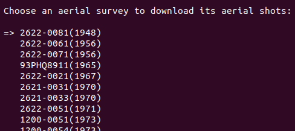
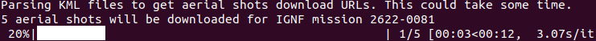

# pva-ign

Basic python script to download [IGNF](https://www.ign.fr/institut/identity-card) aerial shots from [remonterletemps.ign.fr](https://remonterletemps.ign.fr).

## Configuration

The area of interest for finding and downloading aerial shots must be defined in `properties.ini`. The area of interest is defined as a simple bounding box in longitude and latitude. In addition, the `only_intersecting_aerial_shots` option may also be set to `true` or `false` in `properties.ini`. When set to `true` only aerial shots interesecting the area of interest will be downloaded. When set to `false` the complete list of aerial shots for a given survey will be downloaded. 

```ini
[AREA OF INTEREST]
minimum_longitude = 3.2558998675537105
minimum_latitude = 47.36254089577267
maximum_longitude = 3.301390132446289
maximum_latitude = 47.37163871192848
only_intersecting_aerial_shots = true
```

## Usage

```shell
python3 -m venv venv/pva
source venv/pva/bin/activate
(pva) pip3 install -r requirements.txt
(pva) python3 main.py
```

A command line interface will allow to pick the aerial survey of interest based on its identifier or its year. 



Once selected the aerial shots will be downloaded in the `downloads` directory.



## Contributors

[](https://github.com/esgn)

